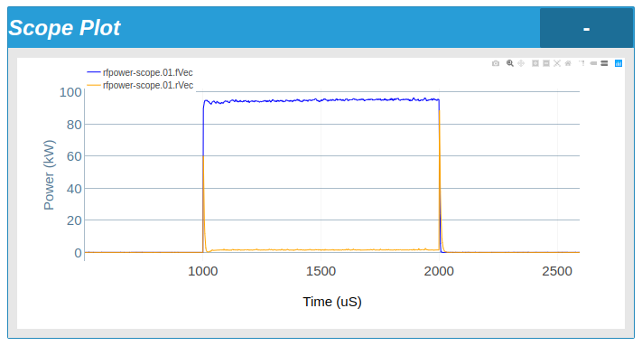
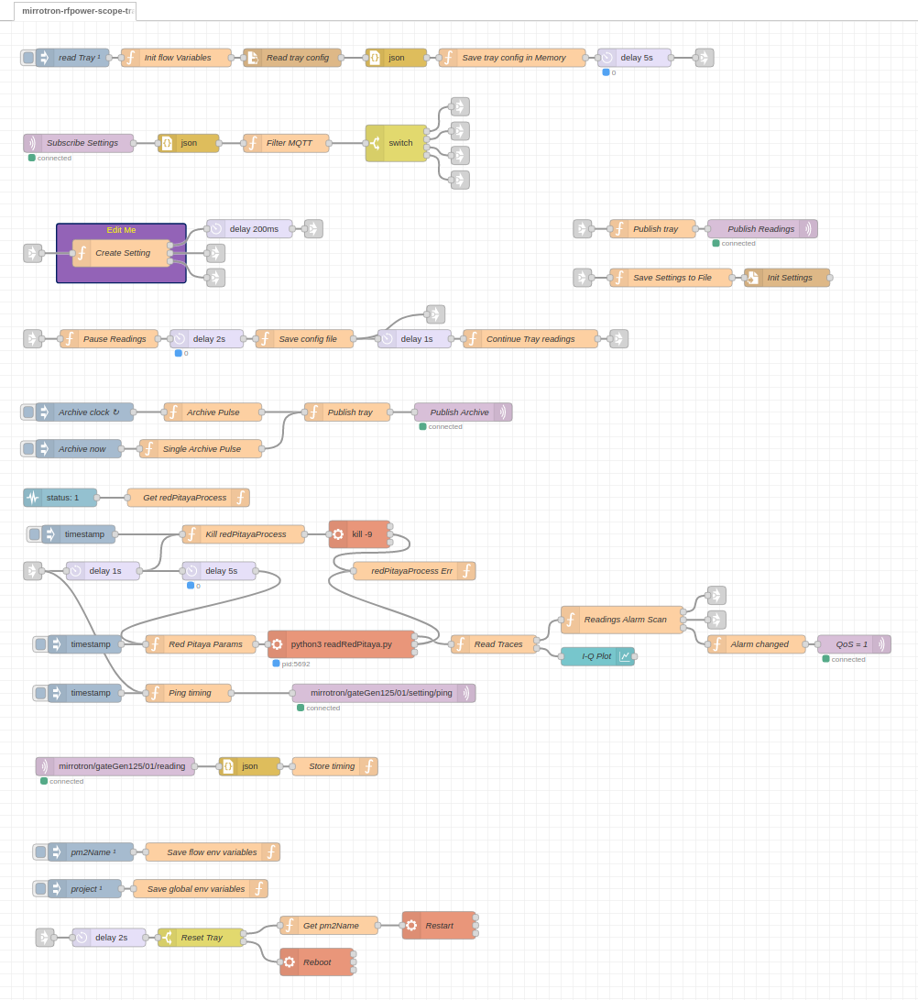
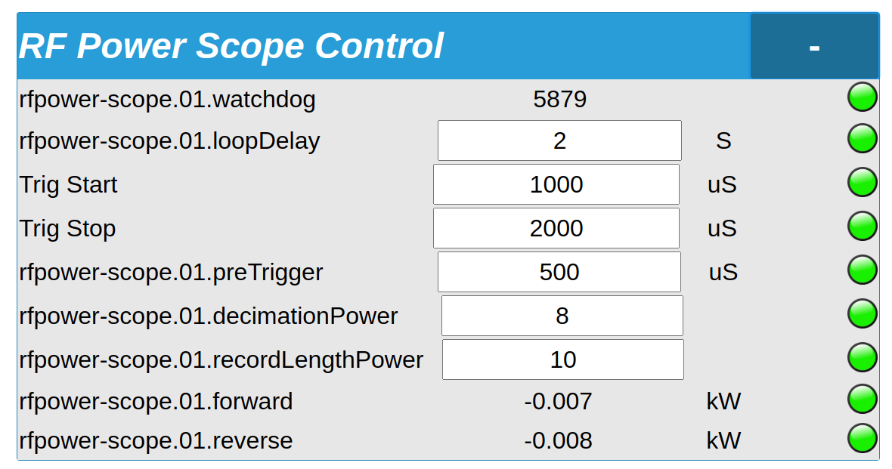

# RF Power Monitor System
* <a href="https://github.com/bl-mirrotron/mirrotron-rfpower-scope-tray" target="_blank">Source code</a>
* [RF source overview](https://docs.bl-mirrotron.com/#rf-src)
* [Control system overview](https://docs.bl-mirrotron.com/)

The RF Power amplifier has a directional 75dB directional coupler mounted on the RF output port. The forward and reflected RF power signals provides are available on the front panel of the RF Power amplifier. These signals are of critical importance to determine if there has been a RF arc inside the cavity or if the cavity is in tune with the <a href="https://docs.bl-mirrotron.com/#rf-src">RF Frequency source</a>. RF Diode detectors mounted on the forward and reflected RF outputs can provide the envelope of the RF waveforms which in turn can be digitized and monitored  at much lower sampling rates than would be required for monitoring a 200 MHz signal as shown in Figure 1.

The Blinky-LiteTM control platform supports vector devices so this diagnostic can be viewed remotely as shown in Figure 1. The <a href="https://redpitaya.com/product-category/stemlab-125-14/" target="_blank">Red Pitaya Stemlab 125-14</a> platform can be used as an inexpensive headless vector data acquisition system (i.e. oscilloscope) instead of using an expensive oscilloscope with display.

To use the Red Pitaya Stemlab 125-14 as a headless vector data acquisition system, the SCPI server on the Red Pitaya Stemlab 125-14 must be <a href="https://forum.redpitaya.com/viewtopic.php?t=2054" target="_blank">enabled</a>. A Python script that continuously acquires vector data from the Red Pitaya was <a href="https://github.com/bl-mirrotron/mirrotron-rfpower-scope-tray/blob/master/readRedPitaya.py" target="_blank">written</a>. Since the Red Pitaya Stemlab 125-14 is a Linux computer, a Blinky-LiteTM tray can be directly installed on the Red Pitaya Stemlab 125-14. The tray code is written in the <a href="https://nodered.org/" target="_blank">Node-RED</a> programming environment as shown in Figure 2. The tray flow is a modified version of the standard  Blinky-LiteTM tray for serial communications. The modified tray flow calls the Python script using an Node-RED Exec node. The script continuously pipes the binary vector data to the stdout which the Exec node pickups and is decoded in the subsequent function node "Read Traces". The data is then packaged in vector format and sent to the <a href="https://docs.bl-mirrotron.com/mirrotron-box/">Mirrotron Application Server</a>. There is a <a href="https://flows.nodered.org/node/node-red-dashboard" target="_blank">Node-RED Dashboard</a> node down stream of the "Read "Traces" function node that can be used to plot the vectors locally for debugging purposes.

The RF Power monitor requires a number of parameters to be set for correct operation.
* The loopDelay determines the interval that the Python Script returns vectors.
* The monitor is triggered using the <a href="https://redpitaya.readthedocs.io/en/latest/developerGuide/hardware/125-14/extent.html" target="_blank">DIO0_P pin</a> on the Red Pitaya. The source of the trigger comes from Channel 4 of the <a href="https://docs.bl-mirrotron.com/#timing-system">Timing system</a>.
* The preTrigger defines how much data to acquire before the trigger start.
* The decimation power determines the sample rate of the acquistion.
  - A decimation power of 8 gives a sample rate of (125 / 28) MS/sec = 488kSamples/sec
* The recordLengthPower determines number of points in the record.
  - A record length of 10 gives 1024 points.

The RF power monitor provides a sampled output taken from the middle of the RF pulse of the forward and reflected power. The sampled output is averaged over 10% of the RF pulse.

Figure 1.   RF Power Monitor Display

 

Figure 2.   RF Power Monitor System Blinky-LiteTMTray Node-RED flow

 

Figure 3.   RF Power Monitor parameters

 
